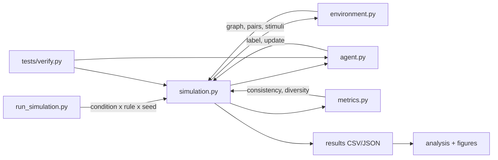

# ABM Emergent Labels — Implementation Plan

## Goal

Build the codebase described in [PROMPT.md](PROMPT.md), following the research-code principles in [SKILL.md](SKILL.md): correctness of the experimental design, reproducibility, interpretability, and simple/readable code. All randomness must be seed-controlled; no hidden randomness.

## Tech stack

- Python 3 with `numpy` (vectors/RNG), `networkx` (Barabási-Albert + lattice + star graphs, degree), `matplotlib` (figures), `unittest` (tests).
- One seeded `numpy.random.default_rng(seed)` per run, threaded through all stochastic steps (graph generation, pair sampling, stimulus sampling, prototype init).

## Architecture / data flow

## Files

| File | Responsibility |
|------|----------------|
| `agent.py` | Prototypes, labeling, updates |
| `environment.py` | BA + lattice + star network construction, pair/stimulus sampling |
| `metrics.py` | Pairwise/overall consistency, prototype diversity, population prototypes |
| `simulation.py` | Main loop, update rules, measurements |
| `run_simulation.py` | Full experimental sweep (6 conditions × 3 rules × 20 seeds) |
| `analysis.py` | H1–H4 evaluation and figures |
| `tests/verify.py` | Verification checks |

## Network conditions

- `lattice` — 2D grid graph (C ≈ 0, low centralization boundary)
- `m1`, `m2`, `m5`, `m10` — Barabási-Albert preferential attachment (smaller m → fewer, larger hubs → higher C)
- `star` — star graph (C = 1.0, high centralization boundary)

## Key design decisions

- Test stimuli (50) are fixed via a dedicated seed so consistency is measured on the same probe set across every run.
- "Hub" = max-degree node; for star this is the center (tests H2 directly).
- H3 dialects are characterized via prototype diversity trajectories and pairwise prototype-distance matrices (clusters of similar prototype configurations).
- H2 measures distance from each agent's initial prototypes to the final population prototypes, plotted vs. agent degree (unconditional update strategy only).
- Convergence time is defined as timesteps to reach 70% pairwise or 70% overall consistency; non-reached conditions are shown as faded bars in H1 and H4 figures.
- H4 comparison uses condition `m2` as the representative centralization level.
- Tie-breaking in labeling is deterministic to preserve reproducibility.

## Out of scope / unchanged

Per SKILL.md, the experimental design (H1–H4, stimulus space, protocol, update rules, centralization manipulation, consistency metrics, verification) is treated as fixed and not modified.
